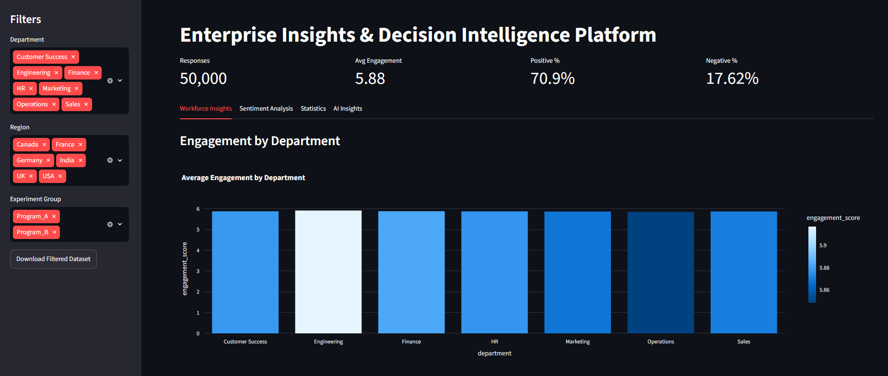
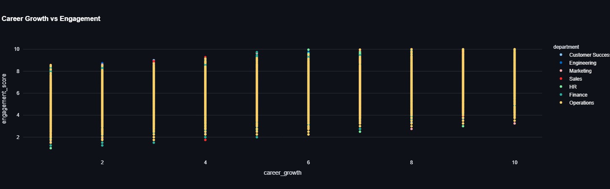
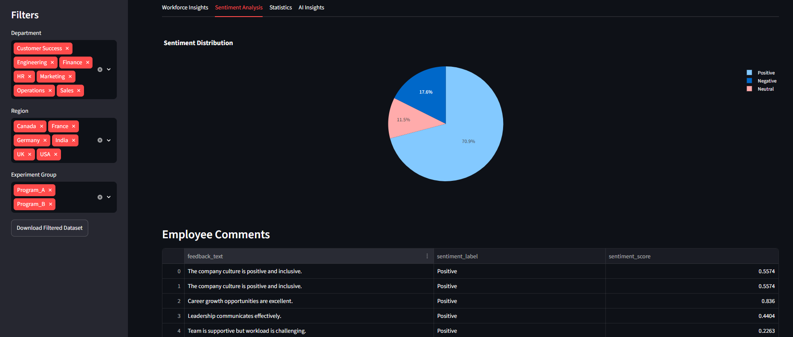
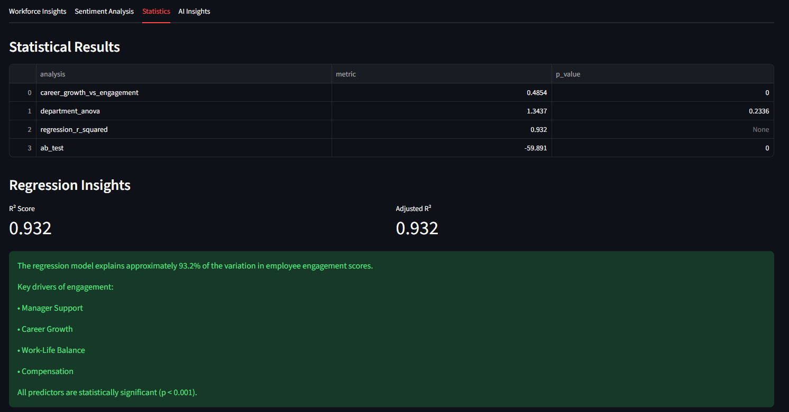
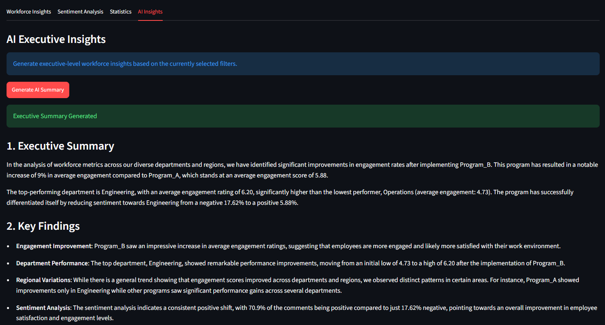

# Enterprise Insights & Decision Intelligence Platform

A full-stack workforce analytics platform that combines:

- Data Engineering
- Statistical Inference
- A/B Testing
- Sentiment Analysis
- AI Generated Insights
- Interactive Streamlit Dashboard

## Screenshots

### Executive Dashboard





---

### Sentiment Analysis



---

### Statistical Analysis



---

### AI Generated Insights




## Features

### Data Engineering

- Polars ETL Pipelines
- PostgreSQL Data Warehouse
- Automated Data Loading

### Analytics

- Correlation Analysis
- ANOVA
- Linear Regression
- Experimental Design
- A/B Testing

### NLP

- Sentiment Analysis
- Topic Extraction

### AI

- Ollama Integration
- Executive Summary Generation
- Workforce Recommendations

### Dashboard

- Streamlit
- Interactive Filters
- Real-Time Analytics

## Tech Stack

- Python
- PostgreSQL
- Polars
- Pandas
- Statsmodels
- Scikit-learn
- Streamlit
- Plotly
- Ollama
- GitHub Actions

## Architecture

# Enterprise Insights Architecture

```text
Employee Survey Data
        |
        v
  Polars ETL Layer
        |
        v
    PostgreSQL
        |
        +----------------+
        |                |
        v                v
 Statistical      Sentiment Analysis
 Analysis              (VADER)
        |                |
        +-------+--------+
                |
                v
        AI Insights Layer
          (Ollama)
                |
                v
       Streamlit Dashboard
```

## Run Locally

```bash
pip install -r requirements.txt

streamlit run streamlit_app/app.py
```

## Testing

```bash
pytest
```
